* MỘT SỐ ẢNH MINH HOẠT ỨNG DỤNG TRÊN GOOGLE-MAP

  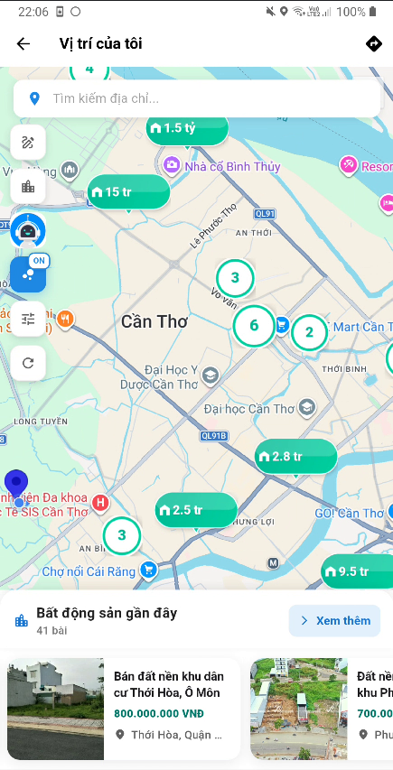
 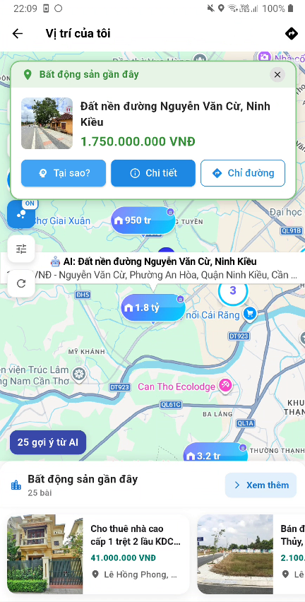
  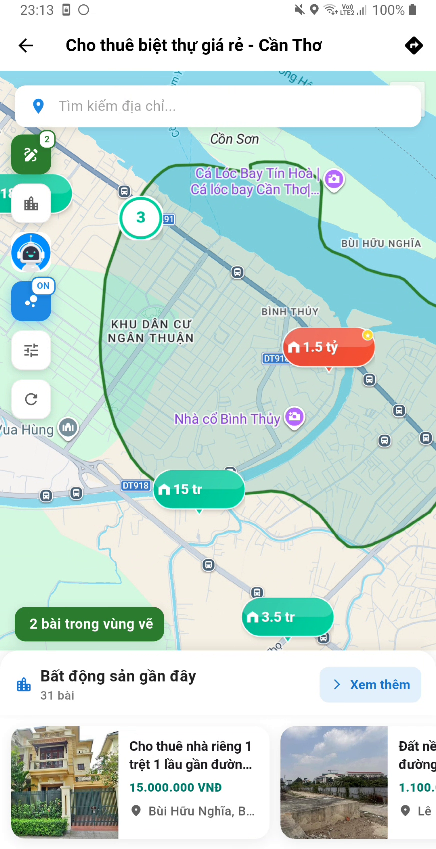

  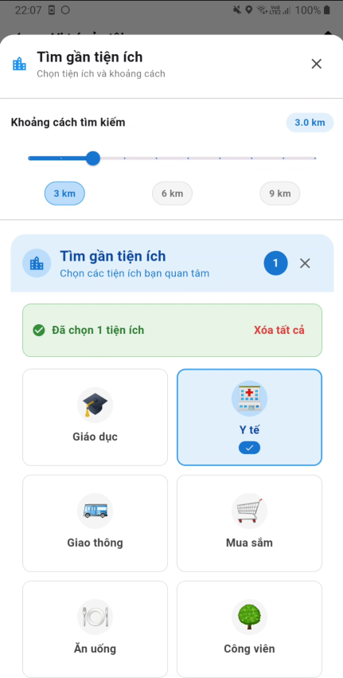
 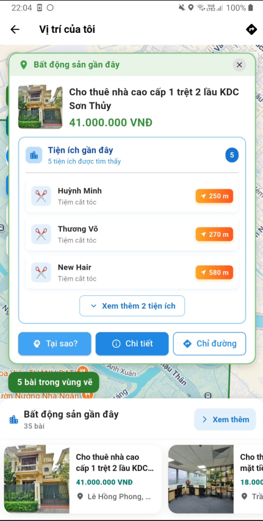
  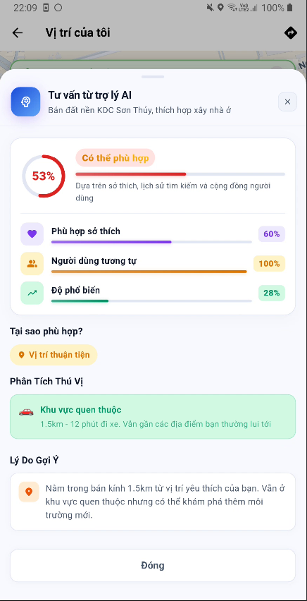

  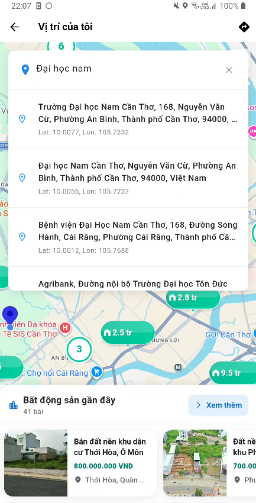
 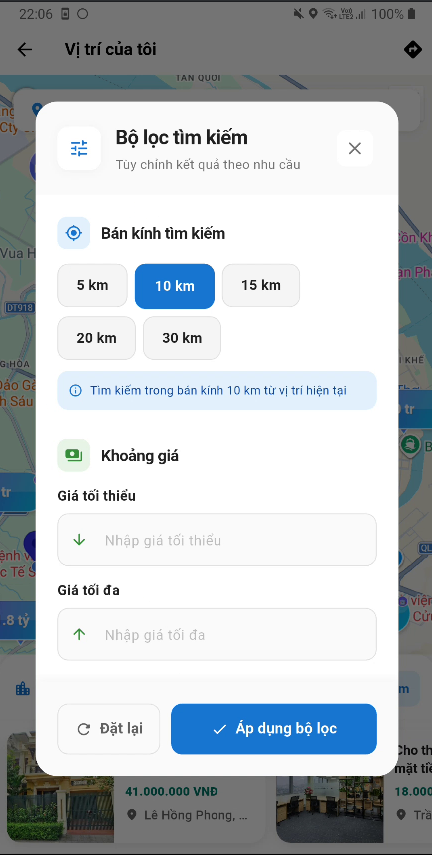
  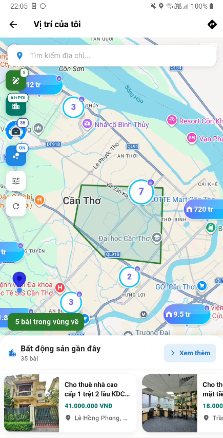

  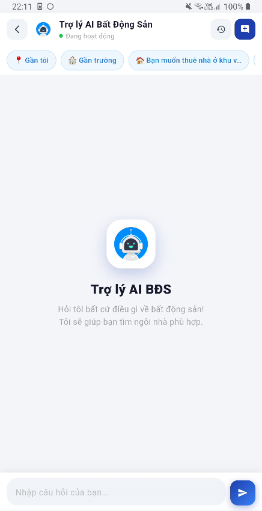
 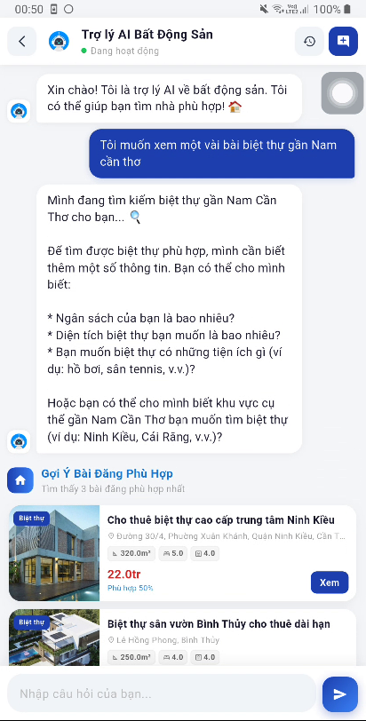
  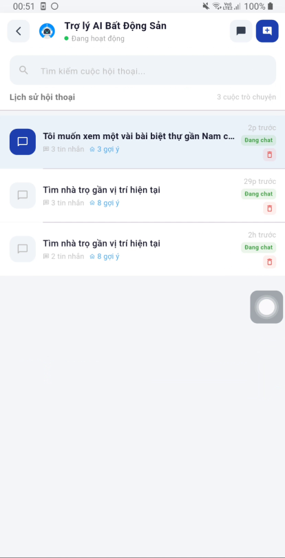

  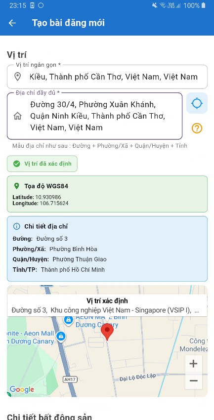
 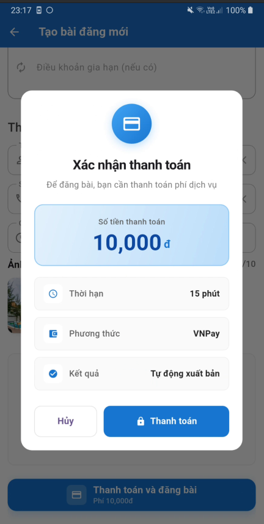
  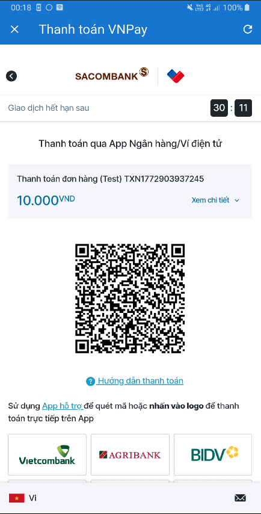

  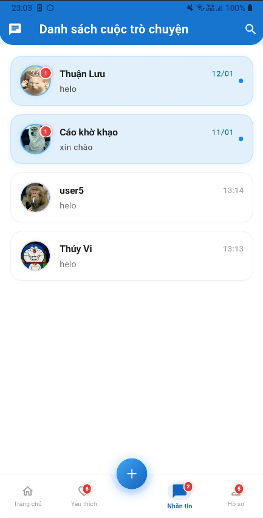
 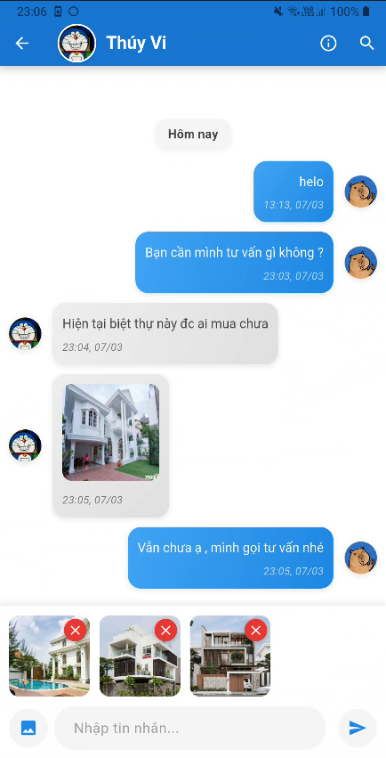
  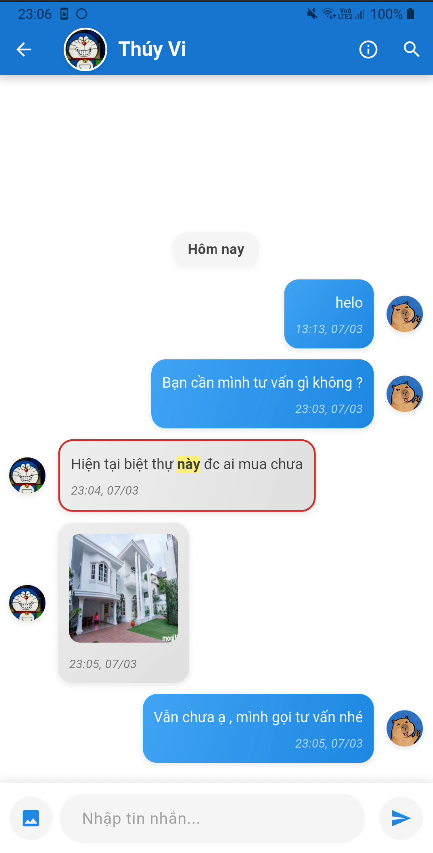

  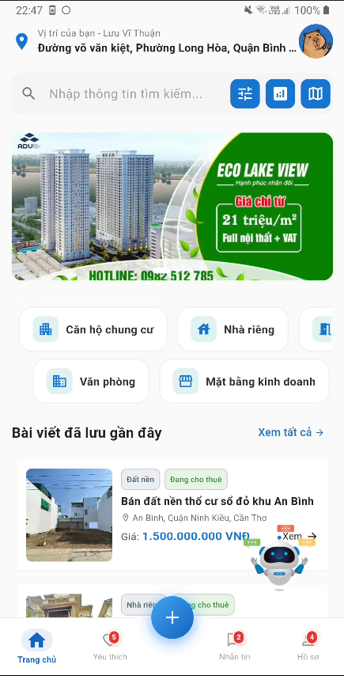
 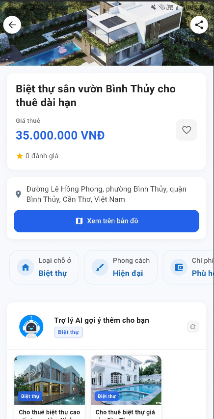
  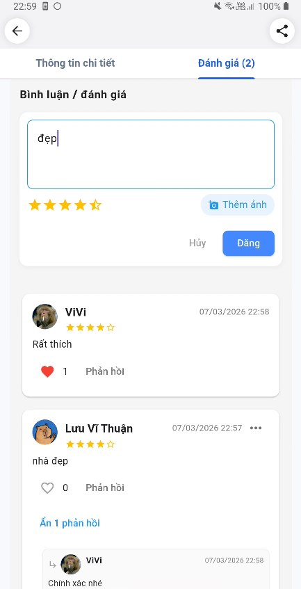

ỨNG DỤNG ĐĂNG TIN BẤT ĐỘNG SẢN TÍCH HỢP MODEL AI GỢI Ý CÁ NHÂN HÓA
1.CÔNG NGHỆ SỬ DỤNG
1.1Về phía Front-End
+ Dart / Flutter : Tạo giao diện đa nền tảng mobile 
1.2Về phía Backend 
+ FLutter : Xử lý hiển thị dữ liệu từ Backend / NodeJS
+ NodeJS / ExpressJS : xử lý dữ liệu từ MongoDB và các logic API 
+ Python : Xử lý thông tin người dùng và gợi ý cá nhân hóa người dùng
1. "Phù hợp sở thích" (content_score) — 0-100%
+ Giá các bài user đã xem/yêu thích : So sánh giá bài này với avg_price, min_price, max_price của user
+ Loại BĐS user hay xem (Nhà riêng, Phòng trọ...) : Tỉ lệ % loại BĐS này trong lịch sử
+ Vị trí các bài user đã xem : Khoảng cách từ bài này đến trung tâm vị trí user
2. "Người dùng tương tự" (cf_score) — 0-100%
Đây là điểm Collaborative Filtering — tìm người dùng có hành vi giống user hiện tại
+ Toàn bộ lịch sử interactions : Ma trận user × rental với điểm tương tác
+ Cosine similarity giữa các user : User A và User B "giống nhau" đến mức nào
+ view=1, click=2, favorite=5, contact=8 : Mức độ quan tâm
3.  "Độ phổ biến" (popularity_score) — 0-100% -> Dành cho gợi ý chẳng hạn như các tài khoản mới
Đây là điểm Popularity-Based — không phụ thuộc vào user cụ thể
+ Tổng điểm tất cả interactions của bài : Bài được quan tâm nhiều cỡ nào
+ Số user khác nhau tương tác : Độ rộng của sự quan tâm
+ Flutter Xử lý đồng bộ dữ liệu các bên
1.3 Database sử dụng : 
+ MongoDB - NoSQL : Tận dụng Geospatial tích hợp xử lý logic hiển thị các bài gợi ý xung quanh
+ Firebase : Lưu trữ thông tin người dùng + tích hợp login Google
+ Redis : Cache dữ liệu tạm thời gọi lại nhanh hơn , không tốn query truy vấn lại trong DB 
1.4 Các công nghệ và dịch vụ khác liên quan : 
+ Tích hợp VNPay thanh toán khi đăng bài trong môi trường sanbox-test
+ Cloudinary : Lưu trữ các hình ảnh và tối ưu dung lượng ảnh , sau đó lưu link ảnh URL trong DB
+ Docker : Tạo môi trường chạy đồng nhất cho Node-JS , Redis , mongoDB , Elasticsearch , NodeJS , Python
+ Socket.IO : Chạy dữ liệu thời gian thực
+ ElasticSearch : tối ưu chỉ mục cho tìm kiếm các bài viết
+ PostMan : Kiểm thử các API
+ Sử dụng Nominatim - OpenStreetMap dịch vụ bản đồ để chuyển địa chỉ sang tọa độ
+ Tích hợp KEY từ OpenAI- Groq : cho chức năng chat giao tiếp tư vấn
+ Sử dụng Bcrypt chuyển mật khẩu sang chuỗi hash lưu trong DB.
2.THÔNG TIN CHỨC NĂNG CÓ TRONG ỨNG DỤNG
2.1Các chức năng chính tương tác trên GoogleMap : 
- Theo dõi các bài đăng hiển thị trên bản đồ GoogleMap
- Bật chế độ AI gợi ý các bài đăng và tư vấn thích hợp với nhu cầu
- Tìm các bài đăng theo tiện ích cụ thể như : mua sắm , nhà hàng, cây xăng ,…
- Vẽ và phân vùng tìm kiếm các BĐS cần xem
- Chế độ gom nhóm các bài đăng cho dễ quan sát trực quan
- Tìm kiếm và gợi ý địa chỉ cụ thể 
2.2Chức năng chatBot-AI tư vấn :
- Gợi ý tư vấn cho người dùng các bài đăng thích hợp từ Model đã Train
- Người dùng có thể tư vấn các bài đăng có mức giá ở địa chỉ cụ thể 
- Xem lại lịch sử chatbot
2.3Các chức năng trong ứng dụng :
- Đăng nhập / Đăng ký / Khôi phục pass qua Email / Đăng nhập GG
- Hiển thị các thông tin loại bất động sản / bài mới tại trang chính 
- Tìm kiếm thông tin BĐS theo loại / từ khóa / khoảng giá 
- Đăng bài tính phí thanh toán thông qua test VNPay
- Lưu lịch sử giao dịch thanh toán
- Tạo cuộc trò chuyện và nhắn tin thông qua bài viết của người đăng BĐS 
- Lưu yêu thích các BĐS 
- Xem chi tiết thông tin BĐS và bình luận / phản hồi / đánh giá cho người dùng trong chi tiết bài đăng , AI hỗ trợ gợi ý các BĐS cùng loại đang xem
- Lưu các thông báo tương tác gần đây trong ứng dụng
- Đăng gửi các góp ý & phản hồi 
- Thông tin hồ sơ cá nhân 
- Xem danh sách bài đăng thuộc trong tài khoản
- Danh sách tin tức 
2.4Các chức năng trong thống kê thông tin bất động sản : 
- Thống kê theo khu vực (biểu đồ cột, phân bố theo tỉnh/quận/phường)
- Thống kê tiện nghi & nội thất (biểu đồ tròn, phân bố các tiện nghi phổ biến)
- Thống kê tăng trưởng theo thời gian
- Hành vi người dùng (lượt xem, yêu thích, liên hệ, tỷ lệ chuyển đổi)
- Phân bố diện tích (biểu đồ cột hoặc box plot)
- Phân bố giá (biểu đồ cột hoặc box plot)
Phân loại BĐS (biểu đồ tròn, % nhà nguyên căn, chung cư, văn phòng, v.v.)
Khu vực nổi bật (danh sách top 5-10 khu vực có nhiều BĐS nhất)
Tổng quan (các chỉ số chính: tổng số BĐS, giá TB, khu vực hot nhất)

* Thông tin chức năng ở phía quản trị ứng dụng : 
